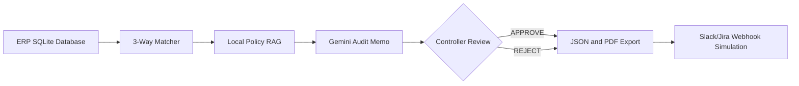
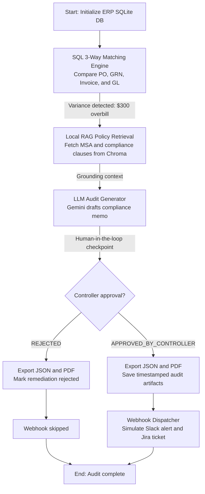

# Autonomous Finance Transformation Pipeline

An enterprise-style finance audit pipeline that reconciles ERP records, grounds findings in corporate policy, requires controller approval, exports audit artifacts, and simulates downstream Slack/Jira notifications.

## Features

- **ERP reconciliation:** Matches purchase orders, goods received notes, vendor invoices, and general ledger entries.
- **Policy RAG:** Retrieves relevant mock MSA and procurement clauses from a local Chroma vector store using deterministic local embeddings.
- **AI audit memo:** Uses Google Gemini to generate a compliance memo grounded in the reconciliation data and retrieved policies.
- **Human-in-the-loop approval:** Pauses for a controller to enter `APPROVE` or `REJECT`.
- **Compliance artifacts:** Writes timestamped JSON audit logs and formatted PDF reports.
- **Webhook simulation:** Dispatches a simulated Slack alert and Jira ticket only after controller approval.
- **Automated tests:** Covers zero variance, overbilling, and rejected webhook behavior.

## Recruiter Demo Video

The generated recruiter demo video is available here:

[Download the Enterprise Finance Agent demo video](videos/enterprise-finance-agent-recruiter-demo.mp4)

It is a 49.13-second portrait MP4 at 1080 x 1920 resolution, featuring the Gemini-powered audit workflow, LangGraph orchestration, SQL 3-way matching, policy RAG, human approval, and audit logging.

## Architecture



The seeded example contains one discrepancy:

- Invoice `INV-502`
- Vendor: SaaS Metrics Corp
- Purchase order: `PO-102`
- Goods received note: `GRN-302`
- Approved PO and GL amount: `$8,200.50`
- Invoice amount: `$8,500.50`
- Variance: `$300.00`

## Business Logic And End-to-End Workflow

The following flowchart shows the complete execution path, including data ingestion, policy retrieval, AI reasoning, human governance, artifact generation, and notification dispatch:



The graph combines modern AI capabilities such as RAG, LangGraph state transitions, and LLM memo generation with conventional enterprise controls including relational ERP records, approval governance, immutable-style audit exports, and downstream incident notifications.

## Requirements

- Python 3.13 or compatible Python version
- A Google Gemini API key
- macOS, Linux, or Windows

The project uses a local Python virtual environment in `venv/`. Run commands with the environment activated or use the explicit `venv/bin/...` paths shown below.

## Setup

From the project directory:

```bash
python3 -m venv venv
source venv/bin/activate
python -m pip install --upgrade pip
python -m pip install pandas numpy python-dotenv langchain-google-genai langchain-core langgraph reportlab chromadb langchain-community pytest
```

On Windows, activate the environment with:

```powershell
venv\Scripts\Activate.ps1
```

Create a `.env` file in the project root. Never commit this file or expose the key in source code:

```env
GOOGLE_API_KEY=your_google_api_key_here
```

## Run The Pipeline

Use the project interpreter:

```bash
venv/bin/python app.py
```

At the human-in-the-loop checkpoint, enter one of:

```text
APPROVE
REJECT
```

For a non-interactive approved demo:

```bash
printf 'APPROVE\n' | venv/bin/python app.py
```

The pipeline performs these steps:

1. Initializes or migrates `enterprise_finance.db`.
2. Reconciles PO, GRN, invoice, and GL records.
3. Retrieves matching corporate policy clauses locally.
4. Generates an AI audit memo with Gemini.
5. Requests controller approval.
6. Exports a JSON audit log and PDF report.
7. Dispatches the simulated webhook only when approved.

Generated files are written to `audit_logs/` with UTC timestamps. Existing artifacts are not overwritten.

## Run Tests

Run tests with the project-local test runner:

```bash
venv/bin/pytest -q
```

Or activate the environment first:

```bash
source venv/bin/activate
pytest -q
```

The test suite verifies:

- A zero-variance invoice produces no discrepancies.
- The seeded `$300.00` overbilling is detected correctly.
- Rejected controller decisions do not dispatch webhooks.

`pytest.ini` adds the repository root to Python's import path. Using a global Anaconda `pytest` may still fail if that interpreter does not have the project's dependencies; use the virtual-environment command above.

## Project Structure

```text
.
├── app.py
├── data/
│   └── erp_mock_transactions.csv
├── enterprise_finance.db
├── tests/
│   └── test_agent.py
├── pytest.ini
├── requirements.txt
├── .env.example
└── .gitignore
```

## Database Schema

`app.py` creates the following SQLite tables and seeds demo records with `INSERT OR IGNORE` so initialization is repeatable:

- `general_ledger`
- `purchase_orders`
- `goods_received`
- `vendor_invoices`

The initializer detects the original invoice schema and adds the missing `po_id` column when upgrading an existing database.

## Dataset Design And Data Lineage

To demonstrate a secure Procure-to-Pay environment without exposing proprietary financial records, this project uses a synthetic dataset. The denormalized CSV representation is available at [`data/erp_mock_transactions.csv`](data/erp_mock_transactions.csv) and the application seeds the same records into SQLite when it starts.

The CSV provides a reviewer-friendly view of the lineage across the four relational ERP tables:

1. **`general_ledger` (GL):** Financial postings with account codes, dates, departments, and recorded amounts.
2. **`purchase_orders` (PO):** Approved spending baselines for vendors, such as `PO-102` for SaaS Metrics Corp at `$8,200.50`.
3. **`goods_received` (GRN):** Evidence that goods or services were received, such as `GRN-302` confirming five units.
4. **`vendor_invoices`:** Supplier billing records linked to the PO and GL transaction.

The dataset intentionally includes one controlled anomaly: `INV-502` bills `$8,500.50` against a `$8,200.50` PO, allowing the pipeline to detect the `$300.00` (`3.66%`) overbilling variance.

## Policy Corpus

The local policy store contains three mock clauses:

- **MSA Clause 4.2:** Invoice amounts above the approved PO baseline require a signed SOW amendment; otherwise place the invoice on hold and issue a debit memo.
- **Procurement Clause 8.1:** SaaS renewal increases are capped at 5% annually with advance written notice.
- **Dispute Resolution Policy 12.0:** Controllers have 48 hours to adjust the ledger or request corrected billing.

These documents are demo data and should be replaced with approved corporate policy sources for production use.

## Security And Production Notes

- Keep `GOOGLE_API_KEY` in environment configuration or a managed secret store. The application intentionally fails fast when it is missing.
- The Slack/Jira integration is currently a console simulation. A production implementation should use authenticated HTTPS requests, retries, idempotency keys, and response logging.
- The JSON files are append-only by filename convention but are not cryptographically immutable. Production audit storage should use controlled access, retention policies, and tamper-evident or write-once storage.
- The local hashed-token embeddings are suitable for the mock corpus and offline tests. Production policy retrieval should use a managed embedding model and persistent vector-store strategy.
- The Gemini-generated memo requires human review and should not independently authorize payments or ledger changes.

## Known Warnings

Depending on installed package versions, execution may display:

- A LangChain warning about `langchain-community` deprecation.
- A Google GenAI warning about automatic function-calling recommendations.

These warnings do not prevent the current pipeline from completing successfully.
